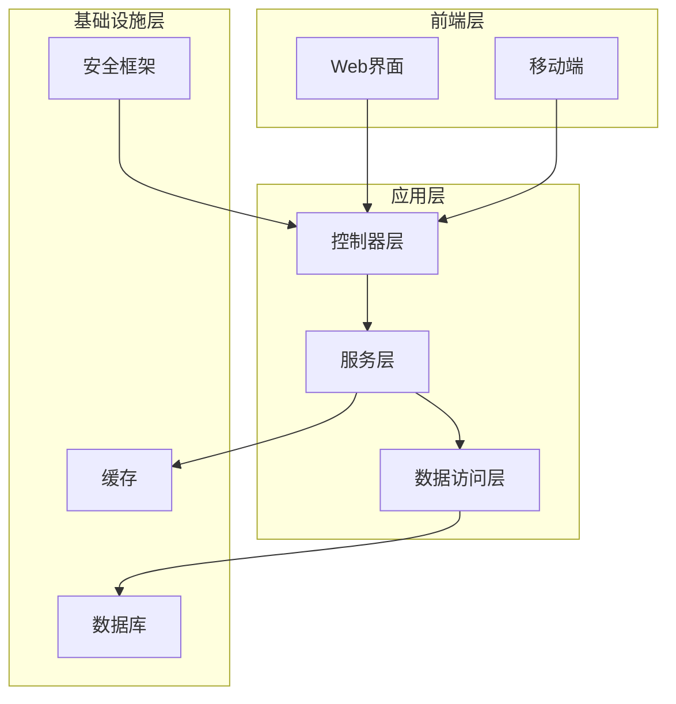
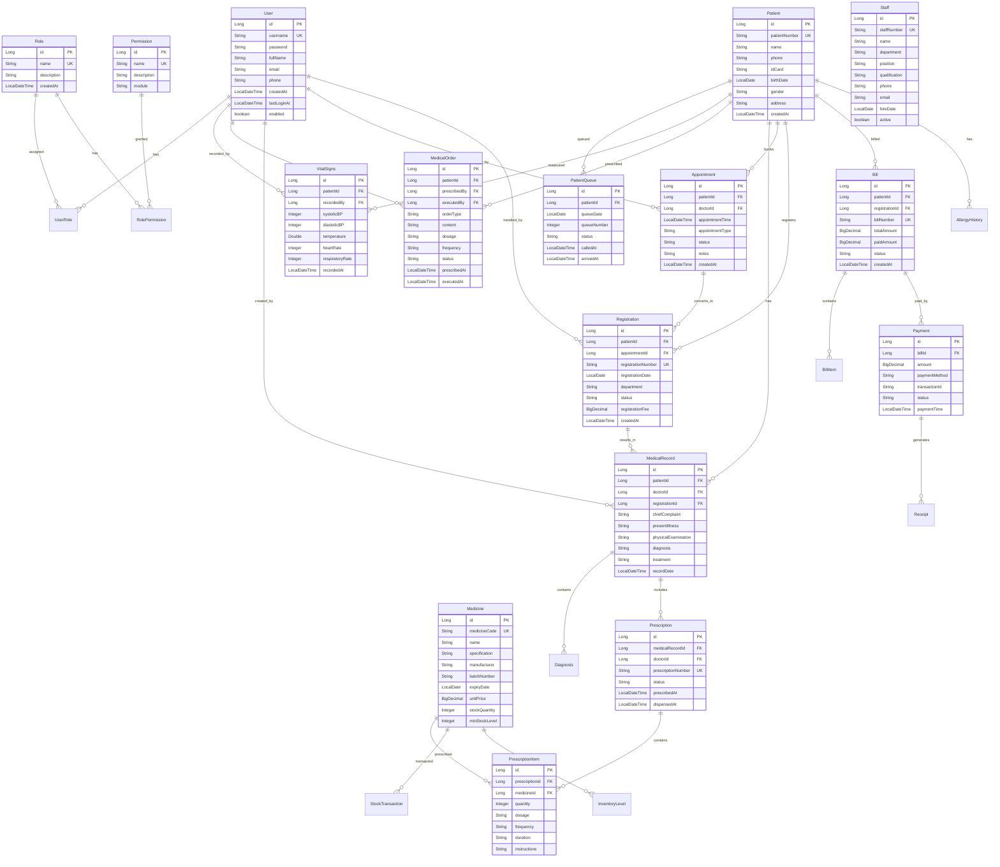
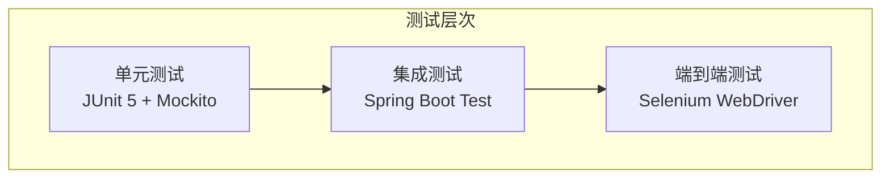

# 设计文档

## 概述

社区诊所管理系统是一个全面的医疗管理平台，采用现代化的分层架构设计，基于Spring Boot框架构建，确保系统的可扩展性、可维护性和安全性。系统采用MVC架构模式，结合RESTful API设计，支持前后端分离的开发模式。

系统包含七大核心模块：
1. **系统管理模块** - 用户认证、角色权限、系统配置
2. **基础信息管理模块** - 患者档案、医护人员、药品物资管理
3. **门诊流程管理模块** - 预约挂号、分诊叫号、电子病历
4. **护士工作台模块** - 分诊叫号、生命体征录入、医嘱执行
5. **诊疗收费模块** - 处方费用计算、多种支付方式、医保对接
6. **药房管理模块** - 药品出入库、库存预警、处方调剂
7. **数据分析与报表模块** - 财务报表、运营分析、患者画像

核心设计原则：
- **安全第一**：采用Spring Security进行身份认证和权限控制
- **数据完整性**：使用JPA/Hibernate进行数据持久化，确保数据一致性
- **模块化设计**：清晰的包结构和职责分离
- **业务流程驱动**：以诊所实际业务流程为核心设计系统架构
- **可扩展性**：预留接口和扩展点，支持未来功能扩展

## 架构

### 系统架构图



### 技术栈

- **后端框架**：Spring Boot 3.x
- **安全框架**：Spring Security 6.x
- **数据访问**：Spring Data JPA + Hibernate
- **数据库**：MySQL 8.0 (生产) / H2 (开发测试)
- **缓存**：Redis (会话管理)
- **构建工具**：Maven 3.x
- **Java版本**：Java 17

### 包结构设计

```
org.me.joy.clinic
├── config/              # 配置类
├── controller/          # 控制器层
│   ├── system/         # 系统管理控制器
│   ├── basic/          # 基础信息管理控制器
│   ├── outpatient/     # 门诊流程控制器
│   ├── nurse/          # 护士工作台控制器
│   ├── billing/        # 诊疗收费控制器
│   ├── pharmacy/       # 药房管理控制器
│   └── report/         # 数据分析报表控制器
├── service/            # 服务层
│   ├── system/         # 系统管理服务
│   ├── basic/          # 基础信息管理服务
│   ├── outpatient/     # 门诊流程服务
│   ├── nurse/          # 护士工作台服务
│   ├── billing/        # 诊疗收费服务
│   ├── pharmacy/       # 药房管理服务
│   └── report/         # 数据分析报表服务
├── repository/         # 数据访问层
├── entity/             # 实体类
├── dto/                # 数据传输对象
├── security/           # 安全相关
├── exception/          # 异常处理
└── util/               # 工具类
```

## 组件和接口

### 1. 用户认证与安全模块

#### 核心组件

**UserAuthenticationService**
```java
public interface UserAuthenticationService {
    AuthenticationResponse authenticate(LoginRequest request);
    void logout(String token);
    boolean validateToken(String token);
    void changePassword(String username, ChangePasswordRequest request);
}
```

**SecurityConfig**
- JWT令牌生成和验证
- 密码加密策略（BCrypt）
- 会话超时配置（30分钟）
- CORS和CSRF配置

#### 数据模型

**User实体**
```java
@Entity
public class User {
    private Long id;
    private String username;
    private String password;
    private String fullName;
    private String email;
    private String phone;
    private LocalDateTime createdAt;
    private LocalDateTime lastLoginAt;
    private boolean enabled;
    private Set<Role> roles;
}
```

### 2. 角色权限管理模块

#### 核心组件

**RoleManagementService**
```java
public interface RoleManagementService {
    List<Role> getAllRoles();
    Role createRole(CreateRoleRequest request);
    void assignRoleToUser(Long userId, Long roleId);
    void removeRoleFromUser(Long userId, Long roleId);
    List<Permission> getRolePermissions(Long roleId);
}
```

#### 权限设计

**权限枚举**
```java
public enum Permission {
    // 系统管理
    SYSTEM_ADMIN,
    USER_MANAGEMENT,
    ROLE_MANAGEMENT,
    
    // 医疗功能
    PATIENT_READ,
    PATIENT_WRITE,
    MEDICAL_RECORD_READ,
    MEDICAL_RECORD_WRITE,
    PRESCRIPTION_CREATE,
    
    // 护士功能
    TRIAGE_MANAGEMENT,
    VITAL_SIGNS_RECORD,
    MEDICAL_ORDER_EXECUTE,
    
    // 药房功能
    PHARMACY_MANAGEMENT,
    PRESCRIPTION_DISPENSE
}
```

### 3. 基础信息管理模块

#### 核心组件

**PatientManagementService**
```java
public interface PatientManagementService {
    Patient createPatient(CreatePatientRequest request);
    Patient updatePatient(Long patientId, UpdatePatientRequest request);
    Patient getPatientById(Long patientId);
    List<Patient> searchPatients(PatientSearchCriteria criteria);
    void addAllergyHistory(Long patientId, AllergyHistory allergy);
    List<MedicalHistory> getPatientMedicalHistory(Long patientId);
}
```

**StaffManagementService**
```java
public interface StaffManagementService {
    Staff createStaff(CreateStaffRequest request);
    Staff updateStaff(Long staffId, UpdateStaffRequest request);
    List<Staff> getStaffByDepartment(String department);
    void updateStaffSchedule(Long staffId, ScheduleRequest request);
    List<Schedule> getStaffSchedule(Long staffId, LocalDate date);
}
```

**InventoryManagementService**
```java
public interface InventoryManagementService {
    Medicine createMedicine(CreateMedicineRequest request);
    Medicine updateMedicine(Long medicineId, UpdateMedicineRequest request);
    List<Medicine> searchMedicines(MedicineSearchCriteria criteria);
    void updateStock(Long medicineId, StockUpdateRequest request);
    List<Medicine> getLowStockMedicines();
    List<Medicine> getExpiringMedicines(int daysThreshold);
}
```

### 4. 门诊流程管理模块

#### 核心组件

**AppointmentService**
```java
public interface AppointmentService {
    Appointment createAppointment(CreateAppointmentRequest request);
    Appointment updateAppointment(Long appointmentId, UpdateAppointmentRequest request);
    List<Appointment> getAppointmentsByDate(LocalDate date);
    List<AvailableSlot> getAvailableSlots(Long doctorId, LocalDate date);
    void cancelAppointment(Long appointmentId, String reason);
}
```

**RegistrationService**
```java
public interface RegistrationService {
    Registration createRegistration(CreateRegistrationRequest request);
    List<Registration> getTodayRegistrations();
    Registration getRegistrationById(Long registrationId);
    void updateRegistrationStatus(Long registrationId, RegistrationStatus status);
}
```

**ElectronicMedicalRecordService**
```java
public interface ElectronicMedicalRecordService {
    MedicalRecord createMedicalRecord(CreateMedicalRecordRequest request);
    MedicalRecord updateMedicalRecord(Long recordId, UpdateMedicalRecordRequest request);
    List<MedicalRecord> getPatientMedicalRecords(Long patientId);
    MedicalRecord getMedicalRecordById(Long recordId);
    void addDiagnosis(Long recordId, Diagnosis diagnosis);
    void addPrescription(Long recordId, Prescription prescription);
}
```

### 5. 护士工作台模块

#### 核心组件

**TriageService**
```java
public interface TriageService {
    List<PatientQueue> getTodayPatientQueue();
    void callPatient(Long patientId);
    void confirmPatientArrival(Long patientId);
    void markPatientAbsent(Long patientId);
    PatientQueue getNextPatient();
}
```

**VitalSignsService**
```java
public interface VitalSignsService {
    void recordVitalSigns(Long patientId, VitalSignsRequest request);
    List<VitalSigns> getPatientVitalSigns(Long patientId);
    boolean validateVitalSigns(VitalSignsRequest request);
}
```

**MedicalOrderService**
```java
public interface MedicalOrderService {
    List<MedicalOrder> getPendingOrders(Long patientId);
    void executeOrder(Long orderId, ExecuteOrderRequest request);
    void postponeOrder(Long orderId, String reason);
    List<MedicalOrder> getExecutedOrders(Long patientId);
}
```

### 6. 诊疗收费模块

#### 核心组件

**BillingService**
```java
public interface BillingService {
    Bill createBill(CreateBillRequest request);
    Bill calculateBill(Long registrationId);
    void addBillItem(Long billId, BillItem item);
    Bill getBillById(Long billId);
    List<Bill> getPatientBills(Long patientId);
}
```

**PaymentService**
```java
public interface PaymentService {
    Payment processPayment(ProcessPaymentRequest request);
    List<PaymentMethod> getAvailablePaymentMethods();
    Receipt generateReceipt(Long paymentId);
    void refundPayment(Long paymentId, RefundRequest request);
}
```

**InsuranceService**
```java
public interface InsuranceService {
    InsuranceClaim createInsuranceClaim(CreateClaimRequest request);
    InsuranceClaim processInsuranceClaim(Long claimId);
    List<InsuranceProvider> getInsuranceProviders();
    InsuranceEligibility checkInsuranceEligibility(Long patientId);
}
```

### 7. 药房管理模块

#### 核心组件

**PharmacyService**
```java
public interface PharmacyService {
    void dispensePrescription(Long prescriptionId, DispenseRequest request);
    List<Prescription> getPendingPrescriptions();
    PrescriptionDispenseRecord getDispenseRecord(Long prescriptionId);
    void returnMedicine(Long dispenseRecordId, ReturnRequest request);
}
```

**StockManagementService**
```java
public interface StockManagementService {
    void recordStockIn(StockInRequest request);
    void recordStockOut(StockOutRequest request);
    StockLevel getCurrentStockLevel(Long medicineId);
    List<StockTransaction> getStockTransactions(Long medicineId);
    void performStockTaking(StockTakingRequest request);
}
```

### 8. 数据分析与报表模块

#### 核心组件

**FinancialReportService**
```java
public interface FinancialReportService {
    DailyFinancialReport generateDailyReport(LocalDate date);
    MonthlyFinancialReport generateMonthlyReport(int year, int month);
    List<RevenueByService> getRevenueByService(LocalDate startDate, LocalDate endDate);
    List<PaymentMethodSummary> getPaymentMethodSummary(LocalDate startDate, LocalDate endDate);
}
```

**OperationalAnalyticsService**
```java
public interface OperationalAnalyticsService {
    PatientVisitAnalytics getPatientVisitAnalytics(LocalDate startDate, LocalDate endDate);
    List<PopularService> getPopularServices(LocalDate startDate, LocalDate endDate);
    DoctorPerformanceReport getDoctorPerformanceReport(Long doctorId, LocalDate startDate, LocalDate endDate);
    WaitTimeAnalytics getWaitTimeAnalytics(LocalDate startDate, LocalDate endDate);
}
```

**PatientAnalyticsService**
```java
public interface PatientAnalyticsService {
    PatientDemographics getPatientDemographics();
    List<CommonDiagnosis> getCommonDiagnoses(LocalDate startDate, LocalDate endDate);
    PatientRetentionReport getPatientRetentionReport();
    List<PatientSatisfactionScore> getPatientSatisfactionScores();
}
```

## 数据模型

### 核心实体关系图



### 数据验证规则

**患者信息验证**
- 姓名：必填，2-50个字符
- 电话：必填，11位数字
- 身份证：18位，符合身份证校验规则
- 出生日期：不能晚于当前日期

**生命体征验证**
- 收缩压：60-300 mmHg
- 舒张压：40-200 mmHg
- 体温：35.0-42.0°C
- 心率：40-200次/分钟
- 呼吸频率：8-40次/分钟

## 错误处理

### 异常层次结构

```java
public class ClinicManagementException extends RuntimeException {
    private final String errorCode;
    private final String message;
}

// 业务异常
public class BusinessException extends ClinicManagementException
public class ValidationException extends ClinicManagementException
public class AuthenticationException extends ClinicManagementException
public class AuthorizationException extends ClinicManagementException

// 系统异常
public class SystemException extends ClinicManagementException
public class DatabaseException extends ClinicManagementException
```

### 全局异常处理

**GlobalExceptionHandler**
```java
@RestControllerAdvice
public class GlobalExceptionHandler {
    @ExceptionHandler(ValidationException.class)
    public ResponseEntity<ErrorResponse> handleValidation(ValidationException e);
    
    @ExceptionHandler(AuthenticationException.class)
    public ResponseEntity<ErrorResponse> handleAuthentication(AuthenticationException e);
    
    @ExceptionHandler(AuthorizationException.class)
    public ResponseEntity<ErrorResponse> handleAuthorization(AuthorizationException e);
}
```

### 错误码设计

- **1000-1999**：认证授权相关
- **2000-2999**：用户管理相关
- **3000-3999**：患者管理相关
- **4000-4999**：护士工作台相关
- **5000-5999**：系统配置相关

## 测试策略

### 测试金字塔



### 测试覆盖率目标

- **单元测试**：代码覆盖率 ≥ 80%
- **集成测试**：API接口覆盖率 ≥ 90%
- **端到端测试**：核心业务流程覆盖率 100%

### 测试数据管理

**测试数据策略**
- 使用H2内存数据库进行单元测试
- 使用TestContainers进行集成测试
- 使用@Sql注解管理测试数据
- 实现测试数据的自动清理机制

### 性能测试

**关键指标**
- 用户登录响应时间 < 500ms
- 患者查询响应时间 < 200ms
- 生命体征录入响应时间 < 300ms
- 系统并发用户数支持 ≥ 100

### 安全测试

**安全测试重点**
- SQL注入防护测试
- XSS攻击防护测试
- CSRF攻击防护测试
- 权限绕过测试
- 密码强度验证测试
- 会话管理安全测试